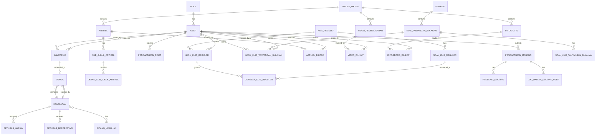
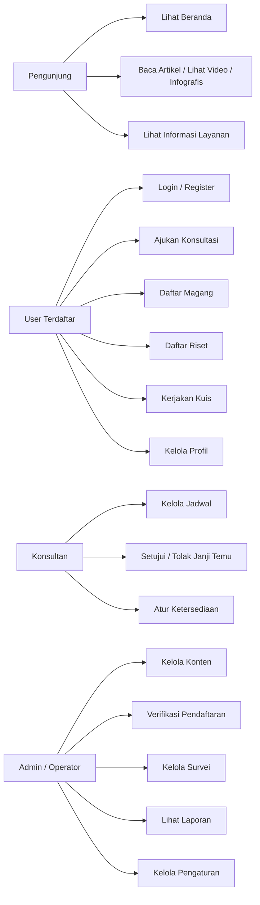
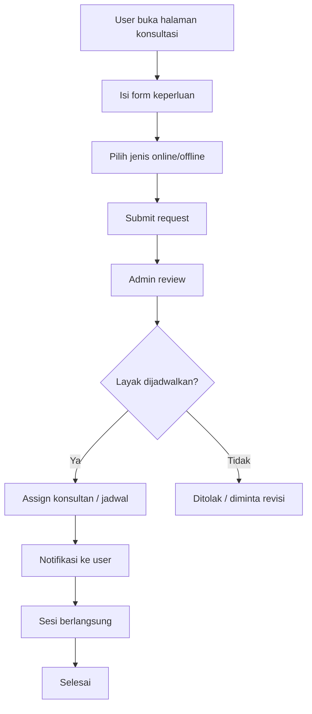
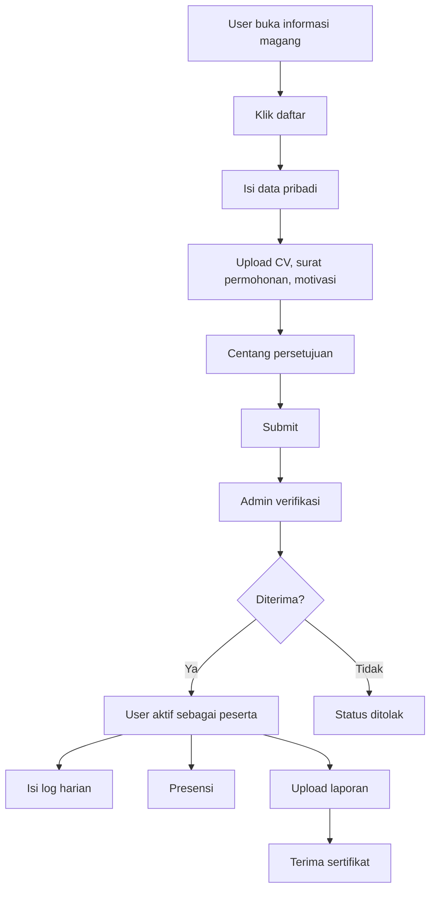
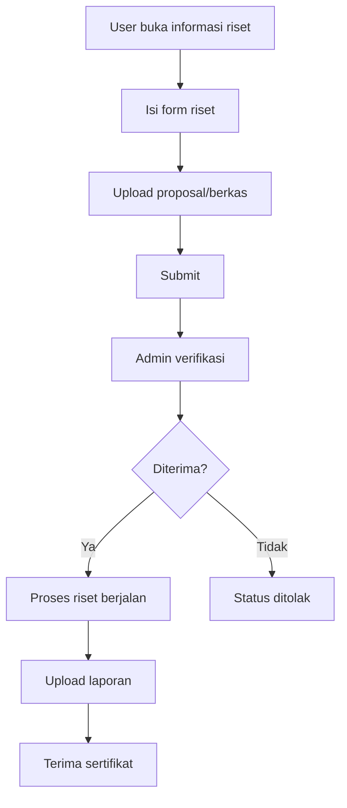
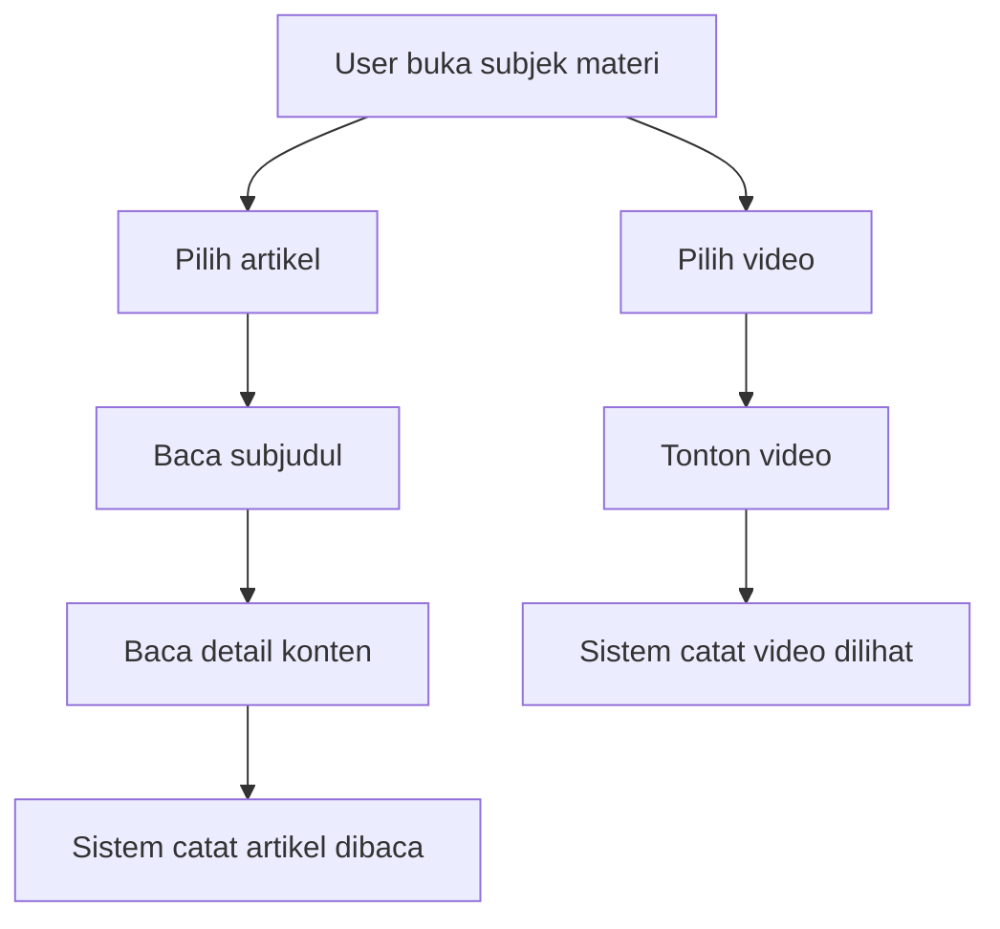
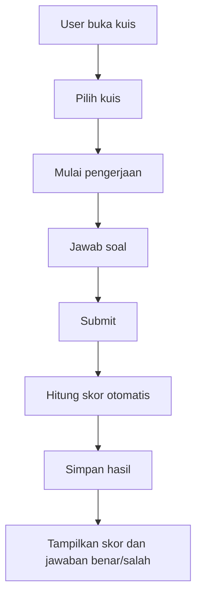

# PRD Enterprise
## Datapedia + Student Corner Integrated Platform

**Dokumen:** Product Requirements Document (PRD)  
**Versi:** 1.0  
**Status:** Draft siap pakai untuk pengembangan lanjutan  
**Basis:** Hasil analisis source code Laravel (routes, models, migrations, controllers)  
**Tanggal:** 2026-06-16

---

## 1. Ringkasan Eksekutif

Datapedia + Student Corner adalah platform layanan digital statistik yang menggabungkan layanan konsultasi statistik, konten edukasi statistik, program magang, program riset, kuis pembelajaran, simulasi statistik, visualisasi data, dan kanal informasi pendukung dalam satu ekosistem web.

Dari source code yang dianalisis, platform ini telah memiliki modul inti yang cukup matang untuk operasi publik, tetapi masih memperlihatkan jejak evolusi bertahap: ada beberapa penamaan legacy yang berbeda antar modul, relasi data yang belum sepenuhnya seragam, serta pemisahan domain yang perlu dirapikan agar sistem siap dikembangkan dalam jangka panjang.

Dokumen ini disusun sebagai PRD enterprise yang dapat langsung dipakai sebagai dasar:
- perbaikan UX/UI,
- refactoring arsitektur,
- penyatuan domain bisnis,
- pengembangan fitur baru,
- penyusunan backlog Jira,
- dan penyusunan dokumen turunan seperti ERD, use case, dan user flow.

---

## 2. Latar Belakang Produk

Sistem ini melayani beberapa kebutuhan utama:

1. **Layanan konsultasi statistik** untuk pengguna umum dan internal.
2. **Pusat pembelajaran statistik** melalui artikel, video, dan infografis.
3. **Program magang** dengan pendaftaran, log harian, presensi, dan sertifikat.
4. **Program riset** dengan pendaftaran dan arsip karya.
5. **Gamifikasi pembelajaran** melalui kuis reguler dan tantangan bulanan.
6. **Alat bantu statistik** seperti kalkulator, simulasi sampling, dan visualisasi data.
7. **Informasi layanan pendukung** seperti FAQ, maklumat layanan, footer informasi, dan survei layanan.

Platform ini cocok diposisikan sebagai **knowledge and service hub** untuk edukasi dan pelayanan statistik.

---

## 3. Tujuan Produk

### 3.1 Tujuan Utama
- Menyediakan layanan statistik yang mudah diakses.
- Meningkatkan literasi statistik masyarakat.
- Memfasilitasi program magang dan riset secara digital.
- Mempercepat proses konsultasi dan penjadwalan.
- Menyediakan kanal edukasi yang terstruktur dan terukur.

### 3.2 Tujuan Teknis
- Menyatukan modul legacy ke dalam arsitektur yang konsisten.
- Mengurangi technical debt.
- Menstandarkan role, permission, dan naming convention.
- Memudahkan pemeliharaan dan perluasan fitur.
- Menyediakan landasan untuk API, mobile app, dan integrasi pihak ketiga.

### 3.3 KPI Produk
- Jumlah pengguna terdaftar aktif.
- Rasio pendaftaran magang dan riset berhasil.
- Jumlah konsultasi yang selesai.
- Engagement konten edukasi (artikel, video, infografis).
- Jumlah pengguna kuis dan completion rate.
- Tingkat kepuasan layanan.
- Penurunan waktu proses administrasi.

---

## 4. Definisi Ruang Lingkup

### 4.1 In Scope
- Landing page dan halaman informasi publik.
- Autentikasi user dan admin.
- Profil pengguna.
- Konsultasi statistik dan penjadwalan.
- Konten edukasi: subjek materi, artikel, subjudul, detail artikel, video, infografis.
- Program magang.
- Program riset.
- Kuis reguler dan tantangan bulanan.
- Simulasi statistik dan visualisasi data.
- Survei layanan.
- Manajemen konten pendukung: FAQ, maklumat, layanan, footer item, petugas, prestasi.
- Dashboard admin dan pengelolaan data.

### 4.2 Out of Scope untuk fase PRD ini
- Aplikasi mobile native.
- Pembayaran online.
- Sistem tiket komplain yang terpisah.
- Integrasi LMS penuh.
- Integrasi AI generatif penuh.
- Public developer API.

---

## 5. Temuan Struktur Sistem dari Source Code

Analisis source code menunjukkan pola modul berikut:

- **Konsultasi**: `janjitemu`, `jadwal`, `konsultan`, `jam-operasional`, `bidang-keahlian`
- **Konten edukasi**: `subjek_materi`, `artikel`, `sub_judul_artikel`, `detail_sub_judul_artikel`, `video_pembelajaran`, `infografis`
- **Program magang**: `informasi_magang`, `pendaftaran_magang`, `log_harian_magang`, `presensi_magang`
- **Program riset**: `informasi_riset`, `pendaftaran_riset`, arsip karya
- **Kuis**: `kuis_reguler`, `kuis_tantangan_bulanan`, soal, jawaban, hasil
- **Alat statistik**: kalkulator, simulasi sampling, distribusi normal, visualisasi data
- **Administrasi umum**: `faq`, `maklumat`, `layanan`, `footer_item`, `survei_layanan`, `petugas`, `petugas_berprestasi`
- **Audit interaksi**: artikel dibaca, video dilihat, infografis dilihat, klik konsultasi

### 5.1 Catatan Arsitektural Penting
Ada dua domain identitas yang perlu diselaraskan:
- `User` untuk pengguna utama platform
- `akunuser` untuk jalur konsultasi/appointment legacy

Selain itu, nomenklatur tabel/model masih bercampur antara bentuk singular, plural, bahasa Indonesia, dan legacy naming. Ini tidak mengganggu fungsi dasar, tetapi perlu distandarkan untuk pengembangan enterprise.

---

## 6. Persona dan Kebutuhan

### 6.1 Pengunjung Umum
Tujuan:
- mencari informasi layanan,
- membaca materi statistik,
- melihat video dan infografis,
- memahami cara menggunakan layanan.

Kebutuhan utama:
- akses cepat ke konten,
- navigasi yang sederhana,
- informasi layanan yang jelas.

### 6.2 Pengguna Terdaftar
Tujuan:
- konsultasi statistik,
- mendaftar magang/riset,
- mengikuti kuis,
- melihat riwayat aktivitas.

Kebutuhan utama:
- profil yang mudah dikelola,
- form pendaftaran yang jelas,
- notifikasi status permohonan.

### 6.3 Mahasiswa/Magang
Tujuan:
- mendaftar program magang,
- mengisi log harian,
- presensi,
- mengunggah laporan,
- menerima sertifikat.

Kebutuhan utama:
- alur yang mudah,
- status proses yang transparan,
- upload dokumen yang aman.

### 6.4 Peneliti
Tujuan:
- mendaftar program riset,
- mengunggah proposal dan laporan,
- mengunduh sertifikat,
- mengakses arsip karya.

Kebutuhan utama:
- tracking status pendaftaran,
- arsip karya yang mudah dicari.

### 6.5 Konsultan
Tujuan:
- melihat jadwal,
- memproses janji temu,
- menandai ketersediaan,
- menolak atau mengarahkan sesi konsultasi.

Kebutuhan utama:
- dashboard jadwal,
- manajemen status yang cepat,
- informasi beban kerja yang ringkas.

### 6.6 Administrator/Operator
Tujuan:
- mengelola seluruh konten dan transaksi layanan,
- memverifikasi pendaftaran,
- memantau aktivitas,
- menyesuaikan publikasi dan pengaturan.

Kebutuhan utama:
- panel admin lengkap,
- filter dan pencarian data,
- audit trail,
- role-based access control.

---

## 7. Prinsip Produk

1. **User first**: alur harus ringkas dan jelas.
2. **One platform, many services**: semua layanan terpusat.
3. **Data-driven**: semua interaksi penting dicatat.
4. **Consistent naming**: istilah dan struktur dibuat seragam.
5. **Secure by default**: semua akses sensitif harus dilindungi.
6. **Scalable**: modul baru harus mudah ditambahkan.
7. **Maintainable**: logic bisnis dipisahkan dari layer presentasi.

---

## 8. Arsitektur Domain

### 8.1 Domain Utama
- Identity & Access
- Consultation Management
- Educational Content Management
- Internship Management
- Research Management
- Quiz & Gamification
- Statistics Tools
- Service Information & Survey
- Admin Operations

### 8.2 Komponen Fungsional
- Public website
- User portal
- Admin portal
- Consultant portal
- Content management
- Transaction/workflow management
- Analytics & reporting

---

## 9. Kebutuhan Fungsional

## 9.1 Identity & Access Management

### Deskripsi
Sistem harus mendukung registrasi, login, logout, reset password, verifikasi OTP/email, pengelolaan profil, dan pembatasan akses berbasis peran.

### Fitur
- Registrasi user.
- Login user.
- Login admin.
- Reset password.
- Verifikasi email/OTP.
- Update profil.
- Role-based access control.
- Riwayat aktivitas user.

### Prioritas
- **Must have**: login, role access, profil dasar.
- **Should have**: OTP/email verification, reset password.
- **Could have**: multi-device session management.

### Aturan Bisnis
- User hanya dapat mengakses fitur tertentu setelah login.
- Admin tidak boleh menggunakan jalur user umum untuk mengubah data sensitif.
- Data profil harus tervalidasi sebelum dipakai di modul pendaftaran.

---

## 9.2 Modul Konsultasi Statistik

### Deskripsi
Modul ini menangani kebutuhan konsultasi statistik, mulai dari pengajuan janji temu, penentuan konsultasi online/offline, penjadwalan, status, hingga dokumentasi hasil.

### Entitas utama dari source
- `janjitemu`
- `jadwal`
- `konsultan`
- `jam_operasional`
- `bidang_keahlian`
- `konsultasi_klik`

### Fitur
- Pengajuan janji temu.
- Pilihan keperluan konsultasi.
- Penentuan jenis konsultasi online/offline.
- Penjadwalan sesi.
- Persetujuan/penolakan oleh admin/konsultan.
- Penyimpanan zoom link bila online.
- Penanda alasan batal/penolakan.
- Monitoring jadwal oleh admin.
- Tracking jumlah klik konsultasi.

### Requirement Detail
- Pengguna dapat membuat request janji temu dari halaman publik/portal.
- Admin dapat mengelola request dan meneruskan ke konsultan.
- Konsultan dapat melihat jadwal yang masuk ke akun mereka.
- Sistem harus menghindari bentrok jadwal untuk waktu dan konsultan yang sama.
- Status konsultasi harus terlihat jelas oleh pengguna.
- Sesi online dapat menyimpan link rapat.

### Status Data yang Disarankan
- `draft`
- `menunggu`
- `disetujui`
- `ditolak`
- `dibatalkan`
- `selesai`

### Acceptance Criteria
- Pengguna berhasil mengirim janji temu dengan data valid.
- Admin/konsultan dapat mengubah status dan memberi catatan.
- Riwayat konsultasi tersimpan dan dapat ditelusuri.

---

## 9.3 Modul Konten Edukasi Statistik

### Deskripsi
Modul ini menyajikan materi edukasi statistik dalam bentuk artikel, subjudul detail, video pembelajaran, dan infografis.

### Entitas utama
- `subjek_materi`
- `artikel`
- `sub_judul_artikel`
- `detail_sub_judul_artikel`
- `video_pembelajaran`
- `infografis`
- `artikel_dibaca`
- `video_dilihat`
- `infografis_dilihat`

### Fitur
- CRUD subjek materi.
- CRUD artikel.
- CRUD subjudul artikel.
- CRUD detail subjudul artikel.
- CRUD video pembelajaran.
- CRUD infografis.
- Tracking pembacaan dan penayangan.
- Kategori/subjek materi untuk mengelompokkan konten.
- Publish/unpublish konten.

### Requirement Detail
- Setiap artikel harus terhubung ke satu subjek materi.
- Satu artikel dapat memiliki banyak subjudul.
- Satu subjudul dapat memiliki banyak blok detail/konten.
- Video dan infografis juga dapat dikelompokkan berdasarkan subjek materi.
- Interaksi user harus tercatat sebagai data analytics dasar.
- Konten publik harus bisa diakses tanpa login, kecuali konten tertentu dibatasi.

### Acceptance Criteria
- Admin dapat membuat, mengedit, menghapus, dan mempublikasikan konten.
- User dapat membaca artikel dan konten dapat tercatat sebagai sudah dibaca.
- Video dan infografis menambah data engagement.

---

## 9.4 Modul Program Magang

### Deskripsi
Program magang memiliki pengumuman informasi, pendaftaran, review administrasi, log harian, presensi, unggah laporan, dan sertifikat.

### Entitas utama
- `informasi_magang`
- `pendaftaran_magang`
- `log_harian_magang_user`
- `presensi_magang`

### Fitur
- Informasi program magang.
- Pendaftaran magang.
- Upload berkas: CV, surat permohonan, surat motivasi.
- Persetujuan syarat.
- Review status pendaftaran.
- Upload laporan magang.
- Upload sertifikat.
- Log harian magang.
- Presensi masuk/pulang.
- Riwayat dan arsip magang.

### Status Pendaftaran
- `diproses`
- `diterima`
- `ditolak`
- `selesai`

### Business Rules
- User harus login untuk mendaftar magang.
- Dokumen wajib harus ada sebelum pendaftaran diproses.
- Pendaftaran yang diterima dapat melanjutkan ke log harian dan presensi.
- Presensi mencatat tanggal, jam masuk, jam pulang, dan koordinat jika tersedia.
- Sertifikat hanya diunggah setelah program selesai atau diterima final.

### Acceptance Criteria
- User dapat mendaftar magang dengan data lengkap.
- Admin dapat memverifikasi pendaftaran dan mengubah status.
- Peserta magang dapat mengisi log harian dan presensi sesuai akses.
- Sertifikat dapat diunggah dan diunduh.

---

## 9.5 Modul Program Riset

### Deskripsi
Program riset menyediakan informasi, pendaftaran, proses verifikasi, arsip karya, dan sertifikat.

### Entitas utama
- `informasi_riset`
- `pendaftaran_riset`

### Fitur
- Informasi program riset.
- Pendaftaran riset.
- Upload proposal/berkas pendukung.
- Tracking status.
- Upload laporan riset.
- Upload sertifikat.
- Arsip karya kolaborasi riset.

### Status Pendaftaran
- `diproses`
- `diterima`
- `ditolak`
- `selesai`

### Acceptance Criteria
- User dapat mendaftar riset dengan judul riset yang jelas.
- Admin dapat memverifikasi dan menutup pendaftaran.
- Arsip karya riset dapat ditampilkan di portal publik.

---

## 9.6 Modul Kuis dan Tantangan Bulanan

### Deskripsi
Sistem mendukung dua jenis gamifikasi pembelajaran:
- kuis reguler,
- tantangan bulanan.

### Entitas utama
- `kuis_regulers`
- `soal_kuis_regulers`
- `opsi_soal_kuis_regulers`
- `jawaban_kuis_regulers`
- `hasil_kuis_regulers`
- `kuis_tantangan_bulanans`
- `soal_kuis_tantangan_bulanans`
- `opsi_soal_kuis_tantangan_bulanans`
- `jawaban_tantangan_bulanans`
- `hasil_kuis_tantangan_bulanans`
- `periodes`

### Fitur
- CRUD kuis.
- CRUD soal.
- Multiple choice / isian singkat.
- Penilaian otomatis.
- Rekap hasil.
- Leaderboard/ranking tantangan bulanan.
- Durasi pengerjaan.
- Filter per periode.

### Requirement Detail
- Kuis reguler dapat diakses kapan saja sesuai status publish.
- Kuis tantangan bulanan harus terikat periode aktif.
- Sistem harus menyimpan skor, jawaban benar, jawaban salah, dan durasi.
- User hanya boleh memiliki hasil terpisah per kuis/periode.
- Soal dapat memiliki gambar pendukung.

### Acceptance Criteria
- User dapat mengerjakan kuis dan menerima hasil otomatis.
- Admin dapat menambah kuis, soal, dan opsi jawaban.
- Tantangan bulanan dapat menampilkan ranking peserta.

---

## 9.7 Modul Simulasi Statistik

### Deskripsi
Modul ini adalah alat bantu pembelajaran statistik interaktif.

### Fitur yang teridentifikasi
- Random sampling
- Slovin calculator
- Distribusi normal
- Kalkulator mean/median/modus
- Kombinasi/permutasi
- Standar deviasi
- Kuartil
- Persentil
- Probabilitas
- Ukuran sampel

### Roadmap
- Regresi linear
- Korelasi
- ANOVA
- Time series
- Uji hipotesis

### Acceptance Criteria
- Perhitungan menghasilkan output yang konsisten.
- User dapat menggunakan alat tanpa login jika dibuka untuk publik.
- Hasil dapat ditampilkan dengan formula yang mudah dipahami.

---

## 9.8 Modul Visualisasi Data

### Deskripsi
User dapat mengunggah dataset untuk menghasilkan visualisasi.

### Grafik yang teridentifikasi
- Scatter plot
- Pie chart
- Line chart
- Boxplot
- Histogram

### Requirement Detail
- Upload dataset.
- Validasi format data.
- Generate grafik.
- Download hasil jika tersedia.
- Tampilkan preview sebelum finalisasi.

### Acceptance Criteria
- Dataset tervalidasi sebelum diproses.
- Grafik yang digenerate sesuai tipe data.
- Error message jelas jika dataset tidak valid.

---

## 9.9 Modul Survei Layanan

### Deskripsi
Survei layanan digunakan untuk mengukur kepuasan pengguna terhadap layanan statistik.

### Entitas utama
- `survei_layanan`

### Fitur
- Link survei per tahun.
- Status aktif/nonaktif.
- Dashboard hasil (direkomendasikan untuk fase berikutnya).
- Pengarsipan link survei.

### Acceptance Criteria
- Hanya satu survei aktif per tahun.
- Admin dapat memperbarui link survei.
- Link survei publik tersedia pada halaman layanan.

---

## 9.10 Modul Informasi Umum dan Konten Pendukung

### Entitas utama
- `faq`
- `maklumat`
- `layanans`
- `footer_items`
- `petugas`
- `petugas_berprestasi`
- `layanan_konsultasi`
- `layanan_perpustakaan`
- `layanan_produk_statistik`
- `layanan_pojok_statistik`
- `layanan_rekomendasi`
- `layanan_website`
- `konsultasi_klik`

### Fitur
- FAQ.
- Maklumat layanan.
- Landing card layanan.
- Footer dinamis.
- Petugas harian.
- Petugas berprestasi.
- Statistik layanan konsultasi.
- Produk layanan digital.

---

## 10. Kebutuhan Data dan ERD

Berikut ERD inti yang disarankan berdasarkan source code. Diagram ini dapat dipakai sebagai baseline model data enterprise.

### Catatan ERD
- `akunuser` pada modul konsultasi legacy direkomendasikan untuk disatukan dengan `users`.
- Pivot `bidang_keahlian_konsultan` perlu dipertahankan sebagai many-to-many.
- Tabel tracking engagement memakai unique composite index agar satu user hanya tercatat sekali per konten.
- Struktur kuis sudah cukup matang untuk analitik pembelajaran.

---

## 11. Use Case Diagram

---

## 12. User Flow Inti

### 12.1 Flow Konsultasi Statistik

### 12.2 Flow Pendaftaran Magang

### 12.3 Flow Pendaftaran Riset

### 12.4 Flow Artikel / Konten Edukasi

### 12.5 Flow Kuis Reguler

---

## 13. Kebutuhan Non-Fungsional

### 13.1 Performance
- Waktu respons halaman umum di bawah 3 detik.
- Proses upload dan generate hasil harus memiliki feedback progres.
- Query list konten harus dioptimalkan dengan pagination.

### 13.2 Security
- CSRF protection aktif.
- Password terenkripsi.
- Role-based access control.
- Rate limiting untuk login dan form publik.
- Validasi file upload.
- Audit log untuk aktivitas admin.

### 13.3 Reliability
- Data transaksi penting tidak boleh hilang.
- Proses upload dokumen harus tahan gangguan jaringan.
- Endpoint penting harus punya fallback message.

### 13.4 Maintainability
- Business logic dipisahkan ke service layer.
- Naming route dan model distandarkan.
- Reusable components untuk form dan tabel.

### 13.5 Scalability
- Cache untuk konten publik.
- Queue untuk notifikasi dan proses berat.
- Storage abstraction untuk file.

### 13.6 Accessibility
- Kontras warna memadai.
- Navigasi keyboard didukung.
- Label form jelas.
- Mobile responsive.

---

## 14. Kebutuhan Keamanan dan Kepatuhan

### Kontrol Minimum
- Validasi server-side di semua form.
- Pengecekan hak akses per route.
- Pencegahan file upload berbahaya.
- Audit aktivitas admin.
- Proteksi data pribadi di form pendaftaran.

### Data Sensitif
- Email
- Nomor HP
- Dokumen pendaftaran
- Status konsultasi
- Informasi sertifikat
- Data lokasi presensi

### Rekomendasi
- Masking data sensitif pada daftar publik.
- File disimpan dengan path aman dan akses terbatas.
- Backup terjadwal untuk database dan storage.

---

## 15. Kebutuhan Reporting dan Analitik

### Dashboard yang Direkomendasikan
- Total pengguna terdaftar.
- Total konsultasi per periode.
- Total pendaftar magang dan riset.
- Total artikel dibaca.
- Total video dan infografis dilihat.
- Completion rate kuis.
- Status pendaftaran aktif.
- Survei layanan per tahun.

### Analitik Source Code yang Sudah Ada
- `artikel_dibaca`
- `video_dilihat`
- `infografis_dilihat`
- `konsultasi_klik`

### Analitik Tambahan yang Direkomendasikan
- waktu rata-rata konsultasi,
- conversion rate pendaftaran,
- engagement per subjek materi,
- top konten,
- funnel pendaftaran magang/riset.

---

## 16. Acceptance Criteria Global

Sistem dianggap memenuhi PRD ini bila:

1. User dapat mengakses layanan publik tanpa hambatan.
2. User terdaftar dapat mengajukan konsultasi, magang, dan riset.
3. Admin dapat memverifikasi dan mengelola semua workflow.
4. Konten edukasi dapat dibuat, dipublikasikan, dan dipantau engagement-nya.
5. Kuis dapat dihitung otomatis dan hasil tersimpan.
6. Simulasi statistik berfungsi untuk alat bantu pembelajaran.
7. Audit dan tracking data utama tersedia.
8. Struktur data siap untuk perluasan modul.

---

## 17. Technical Debt yang Harus Ditangani

### 17.1 Identitas dan Role
- Satukan `akunuser` dan `users`.
- Standarkan role dan permission.
- Dokumentasikan matrix akses.

### 17.2 Naming Convention
- Konsisten untuk model, table, route, controller, dan view.
- Hindari campuran singular/plural yang membingungkan.
- Standarkan bahasa domain.

### 17.3 Arsitektur
- Pindahkan logic berat dari controller ke service.
- Terapkan repository pattern bila diperlukan.
- Pisahkan concern per domain.

### 17.4 Database
- Audit foreign key dan index.
- Samakan naming kolom referensi.
- Tambahkan soft delete bila cocok untuk modul konten.

### 17.5 UX
- Sederhanakan form panjang.
- Tambahkan stepper untuk pendaftaran.
- Tampilkan status workflow secara jelas.

---

## 18. Roadmap Pengembangan

### Fase 1 — Stabilization
- Refactor UI/UX inti.
- Audit role dan permission.
- Standardisasi naming.
- Perbaikan mobile responsiveness.
- Audit database dan relasi.

### Fase 2 — Operational Maturity
- Notification center.
- Status timeline pada semua workflow.
- Dashboard admin yang lebih informatif.
- Export laporan PDF/Excel.
- Filter dan pencarian lanjutan.

### Fase 3 — Learning Expansion
- Learning path per subjek materi.
- Leaderboard kuis.
- Rekomendasi konten.
- Progress user dashboard.

### Fase 4 — Platform Expansion
- API publik.
- Mobile app.
- SSO.
- Integrasi AI assistant statistik.
- LMS ringan untuk pembelajaran terstruktur.

---

## 19. Jira-Ready Product Backlog

> Format: Epic → Story. Prioritas: P0 tinggi, P1 menengah, P2 rendah.

### Epic A — Identity & Access
| ID | Story | Prioritas |
|---|---|---|
| IAM-1 | Sebagai user, saya ingin login agar bisa mengakses fitur pribadi. | P0 |
| IAM-2 | Sebagai user, saya ingin reset password agar bisa memulihkan akses. | P0 |
| IAM-3 | Sebagai user, saya ingin verifikasi email/OTP agar akun saya valid. | P0 |
| IAM-4 | Sebagai admin, saya ingin role-based access control agar tiap akun hanya bisa mengakses menu yang sesuai. | P0 |

### Epic B — Consultation Management
| ID | Story | Prioritas |
|---|---|---|
| CON-1 | Sebagai user, saya ingin mengajukan janji temu konsultasi agar kebutuhan saya ditangani. | P0 |
| CON-2 | Sebagai admin, saya ingin menyetujui/menolak janji temu agar jadwal lebih tertib. | P0 |
| CON-3 | Sebagai konsultan, saya ingin melihat jadwal saya agar saya bisa mempersiapkan sesi. | P0 |
| CON-4 | Sebagai admin, saya ingin menyimpan zoom link agar sesi online mudah diakses. | P1 |
| CON-5 | Sebagai sistem, saya ingin mencegah bentrok jadwal agar konsultan tidak double booking. | P0 |

### Epic C — Educational Content
| ID | Story | Prioritas |
|---|---|---|
| EDU-1 | Sebagai admin, saya ingin mengelola subjek materi agar konten terstruktur. | P0 |
| EDU-2 | Sebagai admin, saya ingin mengelola artikel ber-subjudul agar materi mudah dibaca. | P0 |
| EDU-3 | Sebagai user, saya ingin menonton video pembelajaran agar saya belajar visual. | P0 |
| EDU-4 | Sebagai user, saya ingin melihat infografis agar saya cepat memahami isi materi. | P1 |
| EDU-5 | Sebagai sistem, saya ingin mencatat artikel dibaca/video dilihat agar engagement terukur. | P1 |

### Epic D — Internship Program
| ID | Story | Prioritas |
|---|---|---|
| INT-1 | Sebagai user, saya ingin membaca informasi magang agar saya memahami syarat pendaftaran. | P0 |
| INT-2 | Sebagai user, saya ingin mendaftar magang dan mengunggah dokumen agar pendaftaran saya diproses. | P0 |
| INT-3 | Sebagai admin, saya ingin memverifikasi pendaftaran agar seleksi lebih terkontrol. | P0 |
| INT-4 | Sebagai peserta magang, saya ingin mengisi log harian agar progres saya terdokumentasi. | P0 |
| INT-5 | Sebagai peserta magang, saya ingin melakukan presensi agar kehadiran tercatat. | P0 |
| INT-6 | Sebagai admin, saya ingin mengunggah sertifikat agar peserta dapat mengunduh bukti kelulusan. | P1 |

### Epic E — Research Program
| ID | Story | Prioritas |
|---|---|---|
| RES-1 | Sebagai user, saya ingin melihat informasi riset agar saya tahu persyaratannya. | P0 |
| RES-2 | Sebagai user, saya ingin mendaftar riset agar proposal saya diproses. | P0 |
| RES-3 | Sebagai admin, saya ingin memverifikasi pendaftaran riset agar seleksi berjalan baik. | P0 |
| RES-4 | Sebagai admin, saya ingin mengelola arsip karya riset agar publik dapat melihat hasilnya. | P1 |

### Epic F — Quiz & Gamification
| ID | Story | Prioritas |
|---|---|---|
| QUIZ-1 | Sebagai admin, saya ingin membuat kuis reguler agar user dapat belajar mandiri. | P0 |
| QUIZ-2 | Sebagai admin, saya ingin membuat soal dan opsi jawaban agar kuis berjalan otomatis. | P0 |
| QUIZ-3 | Sebagai user, saya ingin mengerjakan kuis dan melihat hasil otomatis. | P0 |
| QUIZ-4 | Sebagai admin, saya ingin mengatur tantangan bulanan agar ada event berkala. | P1 |
| QUIZ-5 | Sebagai user, saya ingin melihat ranking tantangan bulanan agar termotivasi. | P1 |

### Epic G — Statistics Tools
| ID | Story | Prioritas |
|---|---|---|
| STATS-1 | Sebagai user, saya ingin menggunakan kalkulator statistik agar perhitungan cepat. | P1 |
| STATS-2 | Sebagai user, saya ingin melakukan simulasi sampling agar saya memahami konsep sampel. | P1 |
| STATS-3 | Sebagai user, saya ingin membuat visualisasi data agar analisis lebih mudah dipahami. | P1 |
| STATS-4 | Sebagai user, saya ingin mengunggah dataset agar sistem dapat memproses grafik. | P1 |

### Epic H — Admin & Reporting
| ID | Story | Prioritas |
|---|---|---|
| ADM-1 | Sebagai admin, saya ingin dashboard ringkasan agar saya melihat status sistem secara cepat. | P0 |
| ADM-2 | Sebagai admin, saya ingin mengelola FAQ, maklumat, layanan, dan footer agar informasi publik selalu terbaru. | P1 |
| ADM-3 | Sebagai admin, saya ingin melihat laporan engagement agar saya bisa mengambil keputusan. | P1 |
| ADM-4 | Sebagai admin, saya ingin mengelola survei layanan agar feedback pengguna terkumpul. | P1 |

---

## 20. Rekomendasi Desain Proses Bisnis

### 20.1 Konsultasi
- User isi form.
- Admin triase.
- Konsultan menerima jadwal.
- Sesi berlangsung.
- Hasil dicatat.

### 20.2 Magang
- User daftar.
- Admin verifikasi.
- Peserta aktif.
- Log harian dan presensi berjalan.
- Sertifikat diterbitkan.

### 20.3 Riset
- User daftar.
- Admin verifikasi.
- Proposal diproses.
- Laporan dan arsip dikumpulkan.

### 20.4 Kuis
- Admin publish kuis.
- User mengerjakan.
- Skor dihitung otomatis.
- Hasil disimpan.

---

## 21. Rekomendasi Implementasi Lanjutan

1. Buat lapisan service untuk seluruh domain utama.
2. Satukan autentikasi dan model user.
3. Tambahkan dashboard metrik.
4. Tambahkan notifikasi email/WhatsApp.
5. Buat audit log untuk aktivitas admin.
6. Sediakan export PDF/Excel.
7. Standarkan response status pada semua workflow.
8. Tambahkan test coverage pada fitur inti.

---

## 22. Glossary

- **Subjek Materi**: pengelompokan topik edukasi statistik.
- **Janji Temu**: permintaan konsultasi dari user.
- **Kuis Reguler**: kuis pembelajaran yang bisa dikerjakan kapan saja.
- **Tantangan Bulanan**: kuis berkala dengan periode aktif.
- **Log Harian**: catatan aktivitas peserta magang.
- **Presensi**: pencatatan kehadiran magang.
- **Arsip Karya**: dokumentasi hasil program magang/riset.
- **Engagement**: interaksi user dengan konten.

---

## 23. Penutup

PRD ini dirancang sebagai dokumen kerja yang dapat langsung dipakai oleh product owner, tim developer, UI/UX designer, QA, dan stakeholder operasional. Struktur dan kebutuhan di atas telah disusun berdasarkan modul yang nyata di source code, sehingga cocok menjadi baseline untuk perbaikan, refactoring, dan pengembangan sistem berikutnya.

